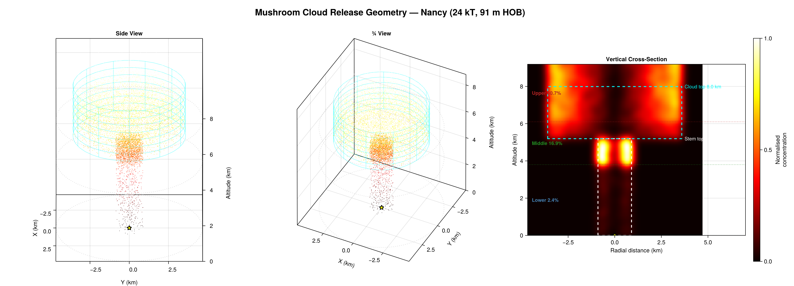

# NuclearDetonation.jl

Nuclear detonation effects and atmospheric dispersion modelling in Julia.

<!-- [](https://github.com/Msturroc/NuclearDetonation.jl/actions/workflows/CI.yml) -->
[](https://opensource.org/licenses/MIT)

## Overview

**NuclearDetonation.jl** is a Julia package for modelling nuclear weapon effects and simulating post-detonation atmospheric transport of radioactive fallout. It couples Glasstone-based weapon effects calculations with a Lagrangian particle dispersion model driven by ERA5 or GFS meteorological data.

<p align="center">
  
</p>

<p align="center">
  
</p>

## Features

### Atmospheric transport

- **Lagrangian particle tracking** — thousands of particles advected through 3D wind fields with sub-grid turbulence
- **Ornstein-Uhlenbeck turbulence** — temporally correlated stochastic velocities via the O-U process, with Hanna (1982) stability-dependent parameterisation and convective boundary layer (CBL) treatment
- **Hybrid coordinate system** — full 137-level ERA5 hybrid sigma-pressure vertical grid with hypsometric height integration
- **ODE solvers** — forward Euler (for reference parity) or Tsit5 5th-order Runge-Kutta via [OrdinaryDiffEq.jl](https://github.com/SciML/OrdinaryDiffEq.jl), with optional adaptive timestepping
- **Dry and wet deposition** — resistance-based and simplified schemes with configurable deposition velocities
- **Gravitational settling** — Stokes-Cunningham settling with Sutherland viscosity correction and bimodal particle size distributions
- **Radioactive decay** — exponential half-life decay and Glasstone t^(-1.2) bomb decay law
- **Multiple dispatch met formats** — separate code paths for ERA5 reanalysis and GFS forecast data, selected automatically from the input files

### Weapon effects (Glasstone & Dolan)

- Blast overpressure (including Soviet overpressure data)
- Thermal radiation
- Initial nuclear radiation
- WSEG-10 fallout model
- Mushroom cloud geometry from yield scaling

### Release geometries

- **Column** — zero-radius vertical column (stack releases)
- **Cylinder** — finite-radius cylindrical volume
- **Mushroom cloud** — two-cylinder stem+cap model with volume-proportional particle distribution
- **NOAA 3-layer** — lower/middle/upper altitude bands with configurable mass fractions

## Installation

```julia
using Pkg
Pkg.add(url="https://github.com/Msturroc/NuclearDetonation.jl")
```

## Quick start

### Bomb release (Nancy 24 kT)

See [`examples/nancy_bomb_release.jl`](examples/nancy_bomb_release.jl) for the full working example. The key steps:

```julia
using NuclearDetonation
using NuclearDetonation.Transport
using Dates

# ERA5 met data downloads automatically from Zenodo (~96 MB, first run only)
era5_files = nancy_era5_files()

# Set up simulation domain from the met grid
domain = Transport.SimulationDomain(
    lon_min = 240.09, lon_max = 249.93,
    lat_min = 35.15,  lat_max = 41.90,
    z_min = 0.0, z_max = 35000.0,
    nx = 36, ny = 25, nz = 137,
    start_time = DateTime(1953, 3, 24, 13),
    end_time   = DateTime(1953, 3, 25, 1),
)

# Release source at Nevada Test Site
release_x, release_y = Transport.latlon_to_grid(domain, 37.0956, -116.1028)
source = ReleaseSource(
    (release_x, release_y),
    CylinderRelease(0.0, 12500.0, 2500.0),
    BombRelease(0.0),
    [48.4e15],   # total activity (Bq)
    10_000,      # particles
)

# Initialise and run
state = Transport.initialize_simulation(domain, [source],
    ["MixedFP"], [Transport.DecayParams(kdecay=Transport.NoDecay)];
    log_depositions=true)

# ... generate particles, configure physics, then:
Transport.run_simulation!(state, era5_files, ...)
```

### Point release (constant source)

See [`examples/point_release.jl`](examples/point_release.jl) for an industrial stack release example using Tsit5 solver and single-bin 5 um aerosol.

## Configuring the solver

```julia
# Forward Euler with O-U turbulence (default)
config = ERA5NumericalConfig(
    ode_solver_type = :Euler,
    fixed_dt = 300.0,
    turbulence = OrnsteinUhlenbeck,
)

# Tsit5 (5th-order Runge-Kutta)
config = ERA5NumericalConfig(
    ode_solver_type = :Tsit5,
    fixed_dt = 300.0,
    turbulence = OrnsteinUhlenbeck,
)

# Adaptive timestepping
config = ERA5NumericalConfig(
    ode_solver_type = :AutoTsit5,
    fixed_dt = nothing,
    reltol = 1e-5,
    abstol = 1e-7,
)
```

## Meteorological data

The package supports two met data formats via multiple dispatch:

| Format | Source | Variables | Vertical |
|--------|--------|-----------|----------|
| `ERA5Format` | ECMWF ERA5 reanalysis | `x_wind_ml`, `y_wind_ml`, `air_temperature_ml`, `omega_ml` | 137 hybrid model levels |
| `GFSFormat` | NCEP GFS forecast | `x_wind_pl`, `y_wind_pl`, `air_temperature_pl` | Pressure levels |

ERA5 data for the Nancy test case is available as a Julia Artifact (~96 MB, [Zenodo DOI: 10.5281/zenodo.18529331](https://doi.org/10.5281/zenodo.18529331)). It downloads automatically on first use via `nancy_era5_files()`.

## Inspired by

- [FLEXPART](https://github.com/flexpart/flexpart) — Lagrangian particle dispersion model
- [glasstone](https://github.com/NukeWorker/glasstone) — Nuclear weapon effects (Python)
- [OrdinaryDiffEq.jl](https://github.com/SciML/OrdinaryDiffEq.jl) — Julia ODE solvers
- [Interpolations.jl](https://github.com/JuliaMath/Interpolations.jl) — Grid interpolation

## Licence

MIT — see [LICENSE](LICENSE).
